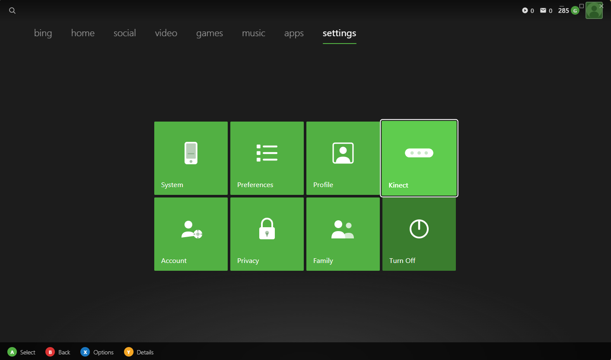
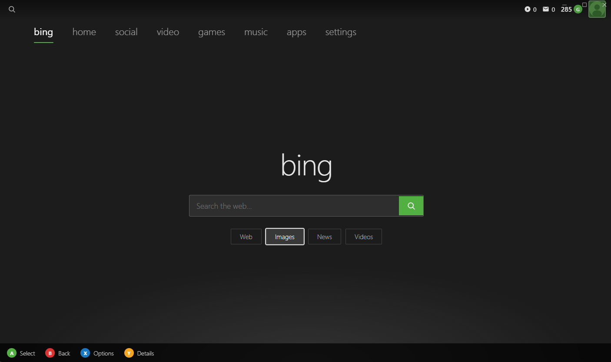
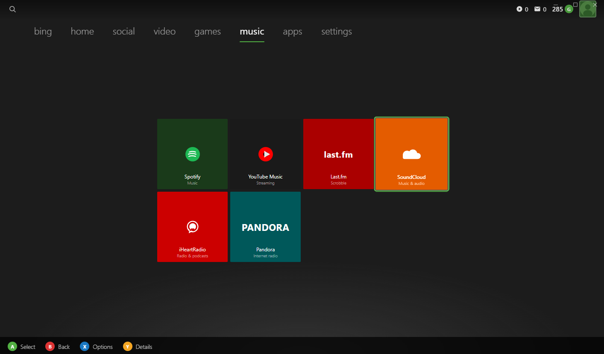

# Xbox 360 Dashboard for PC

A faithful recreation of the Xbox 360 NXE (New Xbox Experience) Metro dashboard, built for PC. Designed for controller-first navigation — launch your games and apps just like on the original Xbox 360.

## Architecture

| Layer    | Technology          | Status      |
|----------|---------------------|-------------|
| Frontend | Electron + HTML/CSS/JS | ✅ In progress |
| Backend  | Spring Boot (Java)  | 🔜 Planned  |

## Project Structure

```
Xbox_360_dashboard/
├── frontend/                  # Electron application
│   ├── src/
│   │   ├── main/
│   │   │   ├── main.js        # Electron main process
│   │   │   └── preload.js     # Secure IPC bridge
│   │   └── renderer/
│   │       ├── index.html     # Dashboard UI
│   │       ├── css/
│   │       │   ├── dashboard.css
│   │       │   └── animations.css
│   │       └── js/
│   │           ├── dashboard.js   # Tab/tile logic
│   │           └── controller.js  # Gamepad & keyboard nav
│   └── package.json
└── README.md
```

## Getting Started

### Prerequisites
- [Node.js](https://nodejs.org/) v18+
- npm v9+

### Install & Run

```bash
cd frontend
npm install
npm start
```

### Development mode (with DevTools)
```bash
npm run dev
```

## Controls

| Input            | Action              |
|------------------|---------------------|
| D-Pad / Arrow keys | Navigate tiles    |
| A / Enter        | Select              |
| B / Backspace    | Back / Home         |
| LB / RB          | Cycle tabs left/right |
| F11              | Toggle fullscreen   |

## Screenshots





## Features (Frontend)

- [x] Metro tile grid (Home tab)
- [x] Tab navigation: bing, home, social, video, games, music, apps, settings
- [x] Xbox controller support (Gamepad API)
- [x] Keyboard navigation fallback
- [x] Spatial D-Pad focus system
- [x] Spotlight / featured content tile
- [x] Side panel (Friends, Social, Sign In)
- [x] Animated entrance transitions
- [x] Toast notifications
- [x] Settings, Social, Games stub panels
- [ ] Games library (awaiting backend)
- [ ] Media playback (awaiting backend)
- [ ] User authentication (awaiting backend)

## Backend Integration

The frontend communicates with the Spring Boot backend via the Electron `preload.js` IPC bridge.
When the backend is running, `window.xboxAPI` exposes:

```js
window.xboxAPI.getGames()           // → Game[]
window.xboxAPI.launchGame(id)       // → { success, message }
window.xboxAPI.toggleFullscreen()   // → void
```

The backend API base URL defaults to `http://localhost:8080`.
